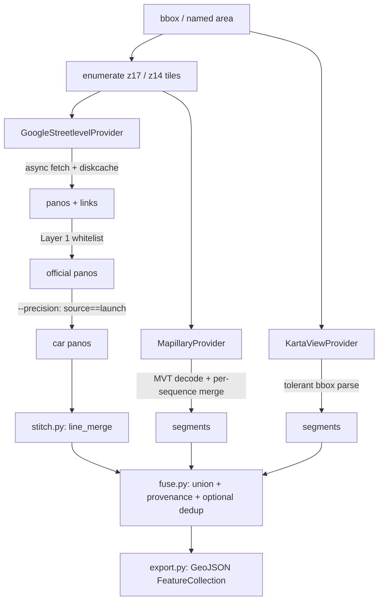
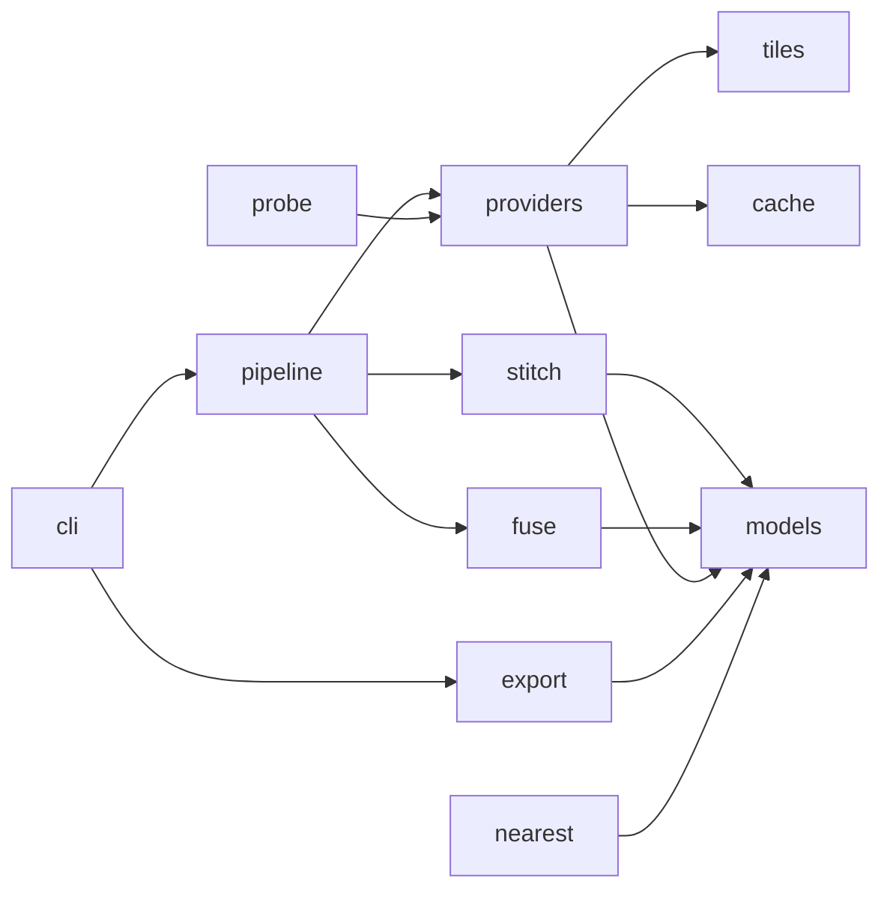

# Architecture

`svcoverage` is a small asyncio pipeline. Each source is a **provider** that returns either
*panos* (nodes to stitch) or *segments* (native lines); the pipeline stitches, fuses, and exports.

## Pipeline



## Modules



| Module | Responsibility |
|--------|----------------|
| `models` | `Pano`, `CoverageSegment`, `Source`, `is_official_panoid`, haversine/length |
| `tiles` | slippy-map tile math (no runtime dependency on `mercantile`) |
| `config` | `BBox`, named areas, `Settings`, env token resolution |
| `cache` | resumable tile cache (`diskcache`, in-memory fallback) |
| `providers/google_sl` | Google coverage graph-walk (the core) |
| `providers/mapillary` | Mapillary `sequence` vector-tile decode + per-sequence merge |
| `providers/kartaview` | KartaView bbox polylines (tolerant, degrades gracefully) |
| `stitch` | panoid graph → merged polylines via `shapely.ops.linemerge` |
| `fuse` | multi-source union + provenance + optional cross-source dedup |
| `export` | GeoJSON (stdlib `json`) + summary stats + optional GPKG |
| `pipeline` / `probe` / `nearest` | orchestration, density probe, point query |

## Key design points

- **No API key for Google.** The core provider walks the z17 coverage tiles directly.
- **Concurrency + resume.** An `asyncio.Semaphore` bounds in-flight requests; a `diskcache` tile
  cache makes a large crawl interruptible/resumable (re-running a bbox reuses cached tiles).
- **Cross-tile continuity is free.** Google returns cross-tile `links` and duplicates boundary
  panos into adjacent tiles, so when a whole bbox is fetched, all links resolve within the set —
  the graph connects across tile boundaries without a special join.
- **Stitching by `line_merge`.** Every graph edge becomes a 2-point line; `shapely.ops.linemerge`
  fuses runs and splits at junctions (degree ≥ 3) automatically. Isolated nodes never form an edge,
  so they drop for free.
- **Geometry is the driven path** (like Google's blue lines), not road-snapped centerlines. Optional
  OSM snapping is available behind the `[snap]` extra.
- **Provider isolation.** A provider that fails (e.g. KartaView endpoint drift) is caught in the
  pipeline and returns empty with a stats note; the run continues on the other sources.

## Provider contract

```python
class Provider(abc.ABC):
    source: Source
    def available(self) -> tuple[bool, str]: ...
    async def fetch(self, bbox, settings, cache) -> ProviderResult: ...

@dataclass
class ProviderResult:
    source: Source
    panos: list[Pano] = []       # point sources -> stitched downstream
    segments: list[CoverageSegment] = []  # native-line sources -> pass through
    stats: dict = {}
```
