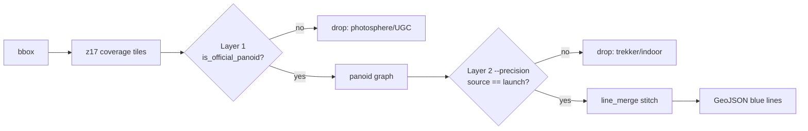

# svcoverage

**Extract the blue lines, never the circles.**

`svcoverage` turns a bounding box into GeoJSON polylines of *continuous official street-level
coverage* — the solid blue Street View lines — while rigorously excluding user photospheres and
photopets (the dots). It fuses **Google** (via [streetlevel](https://github.com/sk-zk/streetlevel)),
**Mapillary**, and **KartaView**.

!!! warning "Disclaimer"
    Research / educational tool, **as-is, no warranty**. The Google provider uses **undocumented
    internal endpoints** (via streetlevel) that may break without notice. **You** are responsible
    for each source's Terms of Service and your local law. Respect rate limits. Not affiliated with
    or endorsed by Google, Meta/Mapillary, or KartaView.

## The HARD RULE

> Output contains **only** genuine official Google car Street View coverage — **never** a user
> photosphere / photopet / photo-path, even a Google-hosted one.

This is the whole point of the tool, and it is enforced as a **normative, testable contract** — see
**[Methodology](methodology.md)** — and proven with a **[reproducible sweep](verification.md)**.



## Where to go

| I want to… | Page |
|------------|------|
| Understand the pipeline internals | [Architecture](architecture.md) |
| See the exact filter rules (RFC-2119) | [Methodology / Filter contract](methodology.md) |
| Re-run the proof myself | [Verification](verification.md) |
| Know what's car vs trekker vs photosphere | [Findings](findings.md) |
| Know what I may do with the output data | [Data provenance](data-provenance.md) |
| Consume the GeoJSON downstream | [Output schema](output-schema.md) |
| Read the API | [API reference](api.md) |
| Use the browser GUI | [GUI](gui.md) |

## Install

```bash
pip install svcoverage                 # Google-capable, no API key
pip install "svcoverage[all]"          # + Mapillary + OSM snapping
```

```bash
svcoverage nearest 44.435072 26.050430
svcoverage extract --area bucharest-city --sources google --out bucharest.geojson
```
